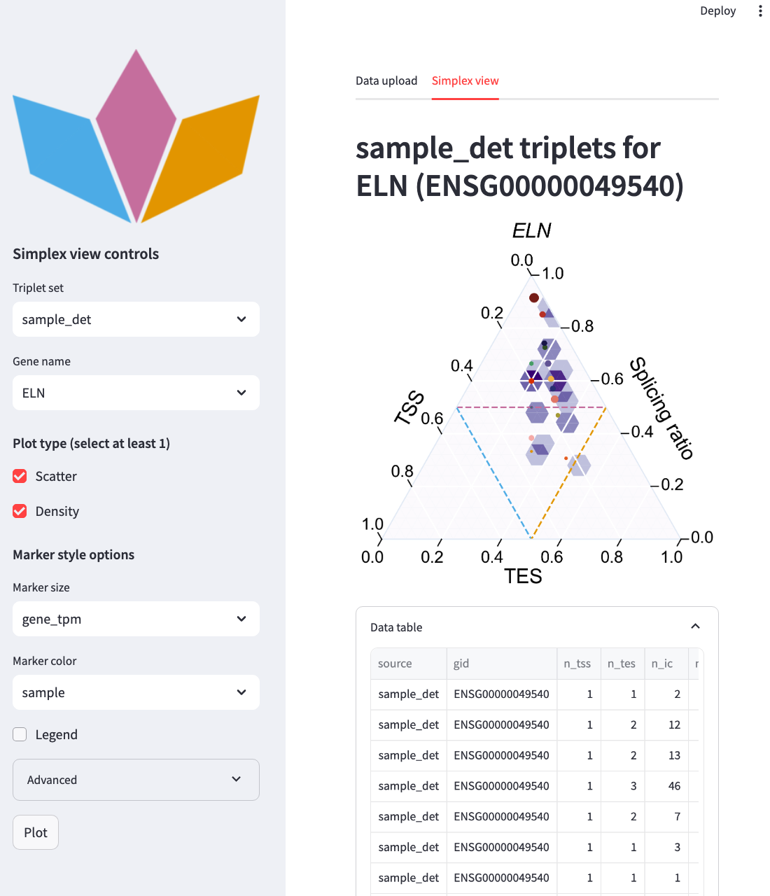

## Cerberus simplex data viewer

The Cerberus data viewer is written with [Streamlit](https://streamlit.io/). It can be run locally or using the Cerberus Docker image.


## Option 1: Running locally

From this folder, run the following:

```bash
streamlit run main.py --server.maxUploadSize 3000
```
# TODO test data mounting!

## Option 2: Running with Docker

First, pull the image:
```bash
docker pull ghcr.io/fairliereese/cerberus-viewer:latest
```

Then, run the Docker image:
```bash
my_data_dir=<directory with your data to mount>
docker run --rm \
  -p 8501:8501 \
  -v ${my_data_dir}/data \
  ghcr.io/fairliereese/cerberus-viewer:latest
```

Open the [Cerberus viewer](http://localhost:8501) in your web browser.

#  Cerberus
