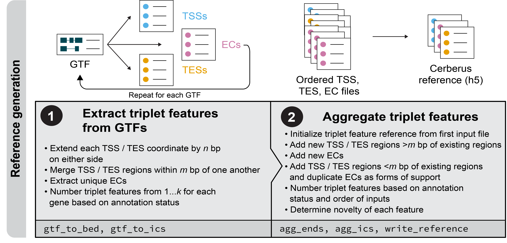
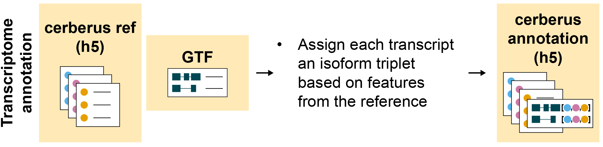
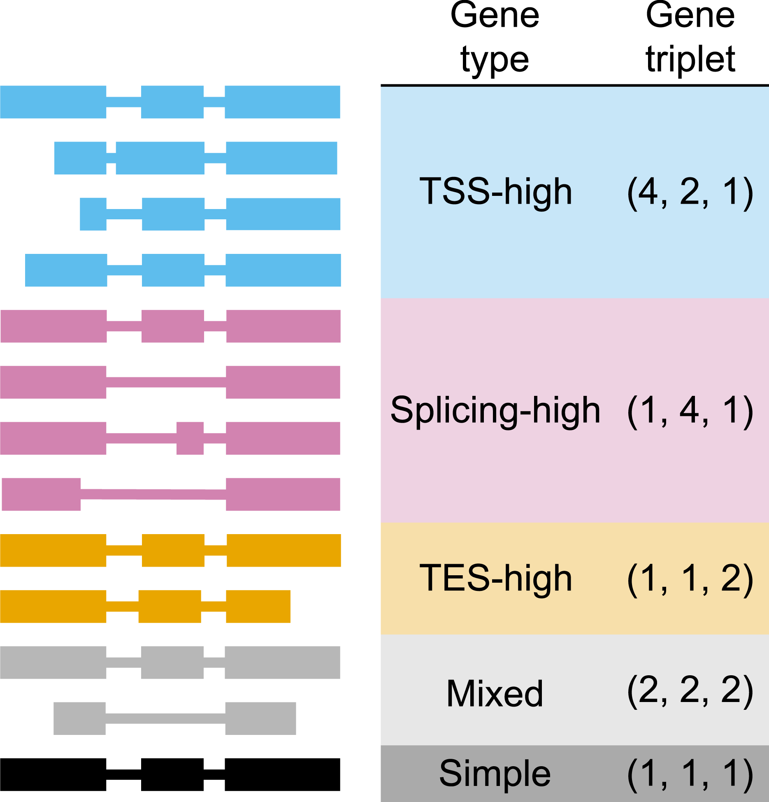

Tutorials
=========

Transcriptome reference generation
==================================

.. _ref_gen:

The first steps of cerberus are to generate a reference set of transcript start
sites (TSSs), intron chains (ICs), and transcript end sites (TESs). TSSs and TESs
can either be added from GTFs or BED files. ICs can be added from GTFs.

Extracting triplet features from GTFs
-------------------------------------
.. _gtf_feats:

.. mdinclude:: gtf_feats.md

Aggregating TSSs and TESs across multiple sources
-------------------------------------------------
.. _agg_bed:

.. mdinclude:: agg_bed.md

Aggregating ICs across multiple sources
-------------------------------------------------
.. _agg_ic:

.. mdinclude:: agg_ic.md

Generating a cerberus reference in h5 format
-------------------------------------------------
.. _write_ref:

.. mdinclude:: write_ref.md

Transcriptome annnotation
=========================

.. _transcriptome_annot:

After generating an h5 Cerverys reference of TSSs, ICs, and TESs, you can now
annotate any transcriptome in GTF format using the features present in your
Cerberus reference; generating **transcript triplets** for each transcript in your
transcriptome. Multiple transcriptomes can be annotated using the same Cerberus
reference. You can then use this mapping to add the Cerberus transcript triplets
to preexisting GTF files and abundance matrices.

Assigning transcript triplets to a transcriptome
---------------------------------------------
.. _annot_t:

.. mdinclude:: annot_t.md

Update counts matrix with Cerberus IDs
--------------------------------------

.. _replace_ab:

.. mdinclude:: replace_ab.md

Update GTF with Cerberus IDs
--------------------------------------

.. _replace_gtf:

.. mdinclude:: replace_gtf.md

Calculating gene triplets
=========================

.. _gene_trips:

After you've generated your final Cerberus annotation h5 file for as many
transcriptomes as you wish with ``cerberus annotate_transcriptome``, you can now start to
calculate **gene triplets** as a metric of measuring transcriptional diversity.
There are a few different ways of doing this.

Calculating gene triplets from Cerberus sources
------------------------------------------------
.. _source_triplets:

.. mdinclude:: source_triplets.md

Calculating gene triplets from a list of transcriptomes
-------------------------------------------------------
.. _subset_triplets:

.. mdinclude:: subset_triplets.md

Calculating gene triplets based on transcripts expressed in a sample
-----------------------------------------------------------------
.. _sample_triplets:

.. mdinclude:: sample_triplets.md

Calculating gene triplets directly from a GTF
-----------------------------------------------------------------
.. _gtf_to_triplets:

.. mdinclude:: gtf_to_triplets.md

Calculating gene triplets from custom subset files
--------------------------------------------------

.. _custom_subset_triplets:

.. mdinclude:: custom_subset_triplets.md
